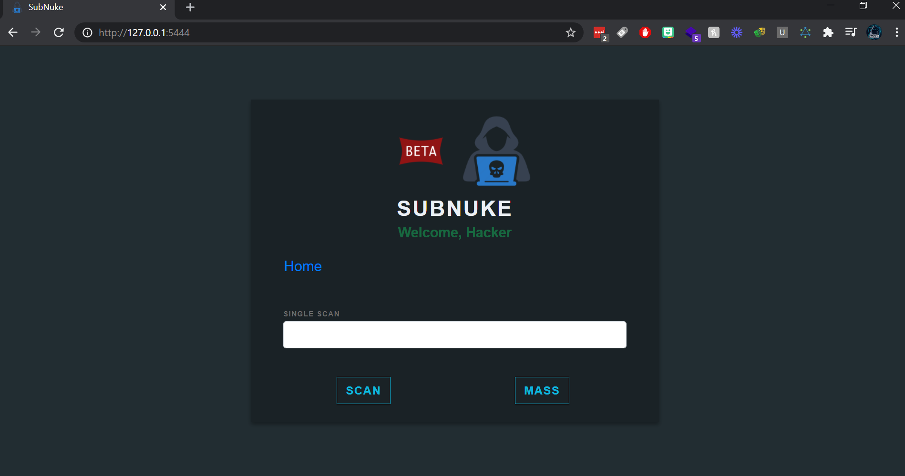
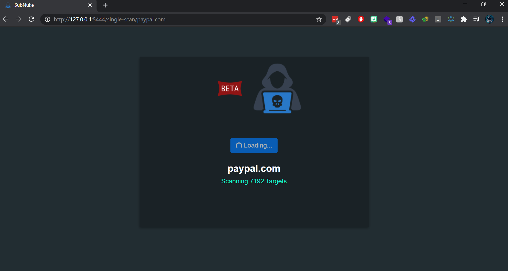

# SubNuke
Subdomain Takeover tool with web UI
<br>
[](https://opensource.org/licenses/MIT)

# Install

```bash
chmod +x install.sh ; ./install.sh
```

```bash
python3 app.py
```

# Tools used

* Chaos
* Subfinder
* Crobat
* dnsgen
* metabigor
* masscan
* subtake

# Features

* File upload option to run scans against multiple.
  
* Run scans against a single domain.

### Contributors
<a href="https://github.com/ethicalhackingplayground/SubNuke/graphs/contributors">
  
</a>


**Feel free to change the bash scripts to implement more recon techniques**

### Menu


### Scan



# Video
[](https://www.youtube.com/watch?v=pYewle2HcTw&ab_channel=krypt0muxbugbounty)

<br>
<a href="https://www.buymeacoffee.com/krypt0mux" target="_blank"></a>
